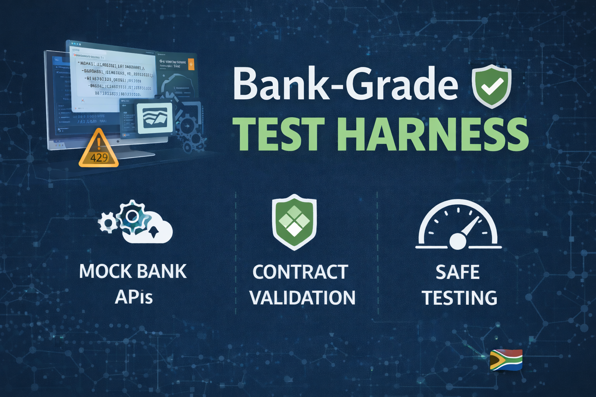
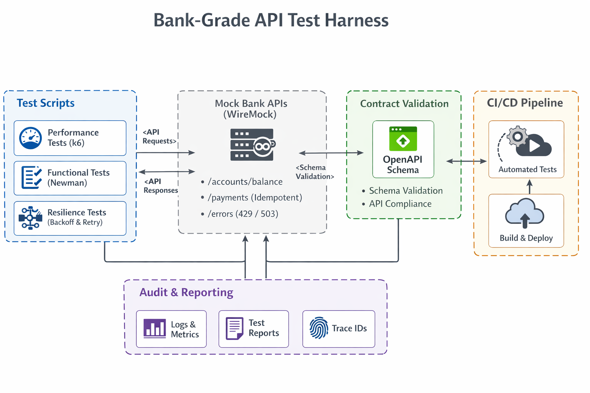

# Bank API Test Harness



## Why This Project Exists

This repository demonstrates how regulated banking
integrations are tested responsibly using:

- Mocked banking APIs
- Idempotent payment flows
- Controlled retry logic
- Explicit throttling limits
- Audit-ready request tracing

This mirrors real-world expectations of South African
and international banking partners.

## Quick Start

### Prerequisites
- Docker & Docker Compose v2
- [k6](https://k6.io/docs/get-started/installation/) (load testing tool)

### Setup

```bash
# Start WireMock with bank mocks
npm run mock:start

# Run payment flow tests
npm test

# Run specific tests
npm run test:audit
npm run test:retry

# Stop mocks
npm run mock:stop
```

### Environment Configuration



Tests support environment-based URLs:

```bash
k6 run -e API_URL=https://staging.example.com tests/performance/payment-flow.test.js
```

### CI/CD

GitHub Actions automatically runs all tests on push and pull requests. See [.github/workflows/bank-api-tests.yml](.github/workflows/bank-api-tests.yml) for details.